# 隐语SecretPad平台新增组件

**目标读者：基于隐语SecretPad平台进行二次开发的工程人员**

目前隐语已经推出隐语SecretPad平台的MVP部署包，请通过此[链接](https://www.secretflow.org.cn/docs/quickstart/mvp-platform)
了解、部署，使用隐语SecretPad平台的预览版。

本教程将会和读者一起新建一个隐语组件来利用MPC技术比较两方数据表的大小关系，或者说著名的百万富翁问题。

本文将会简要介绍很多隐语中的概念，但是限于篇幅所限，仍然需要读者阅读相关文档来新增一个相对复杂的算子。

# 什么是隐语组件？

在隐语平台中，你需要基于一系列组件来组建训练流：

- **组件**：隐语提供的最小粒度的计算任务。
- **组件列表**：组件的集合。
- **组件实例**：组件的一次调用。
- **训练流**：组件实例的DAG流。


每一个组件（以“隐私求交”为例）都有以下接口：

- 输入(input)

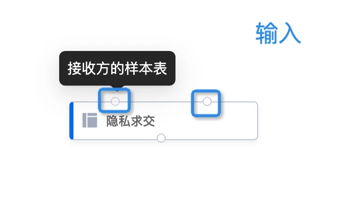

- 输出(output)

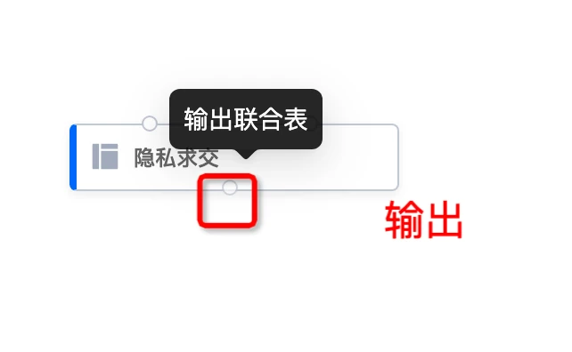

- 参数(attribute)

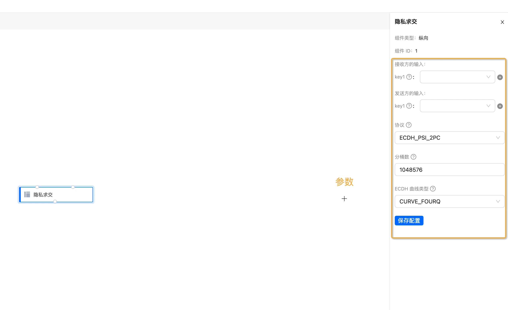

你可以利用官方提供的隐语组件来构建一个训练流来完成相对复杂的一个隐私计算任务。然后有时候你可能会有以下诉求：

- 我想修改某个组件的实现（我发明了更好的算法）。
- 我想修改某个组件的参数。
- 我想支持新的输入类型。
- 我想创建一个新的组件。

在开始教程之前，我们先简单了解一下，隐语组件在整个平台产品中的角色。

下图描述了隐语技术栈各模块的关系：

- 1.SecretPad是隐语平台的用户界面，用户在这里可以看到所有组件列表；用户利用组件来构建训练流。
- 2.Kuscia节点部署在每一个计算方，负责拉起隐语组件实例。
- 3.SecretFlow镜像包含了隐语的binary，负责实际执行组件实例。

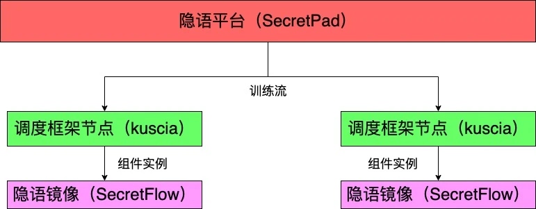

如果你现在需要修改/新增一个组件，你需要：

- 修改隐语代码
- 打包隐语镜像
- 更新隐语SecretPad平台组件列表
- 在调度框架Kuscia中注册新的组件镜像

# 需求描述

假设alice和bob是两位富翁，他们各自有一份银行存款列表，比如

Alice：

| **bank** | **deposit** |
|----------|-------------|
| chase    | 10000000    |
| boa      | 15000000    |
| amex     | 190000      |
| abc      | 120000      |

bob：

| **bank** | **deposit** |
|----------|-------------|
| boa      | 1700000     |
| chase    | 15000000    |
| amex     | 150000      |

在原始的百万富翁问题中，alice和bob会比较各自的总资产，在我们的setting中，两位富翁决定比较各自不同银行账号的资产（单调且乏味）。

当然每位富翁提供的存款列表不一定是对齐的，这一步无需担心，我们可以用PSI来解决这个问题。隐语组件中已经提供PSI组件。

假设双方的原始数据是这样的：

📎[alice_bank_account.csv](https://www.yuque.com/attachments/yuque/0/2023/csv/29690418/1692964409932-ae408839-c9a0-47d8-af28-9586e32315f3.csv)

📎[bob_bank_account.csv](https://www.yuque.com/attachments/yuque/0/2023/csv/29690418/1692964412445-26b38397-cac9-4223-938e-9c08ca4e612e.csv)

最后两边都需要知道交集中每家银行账号自己的存款是否比对方多。

# 修改隐语代码

当我们修改代码之前，我们需要简单了解以下隐语镜像中的层级关系：

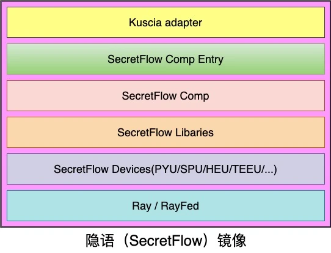

1.Kuscia Adapter：将kuscia的数据结构转化为SecretFlow组件数据结构。代码位于：https://github.com/secretflow/secretflow/blob/main/secretflow/kuscia/entry.py 你不需要修改这里。

2.SecretFlow Comp Entry：读取SecretFlow组件数据结构，调用对应的组件。代码位于：https://github.com/secretflow/secretflow/blob/main/secretflow/component/entry.py 你需要在这里声明组件。

3.SecretFlow Comps：所有隐语组件。代码位于：https://github.com/secretflow/secretflow/tree/main/secretflow/component 你需要在这个文件夹下创建你的新组件。

4.SecretFlow Libraries：隐语API。你可以利用所有隐语现有的各类算法来构造组件。你可以在这个[链接](https://www.secretflow.org.cn/zh-CN/docs/secretflow/v1.4.0b0/user_guide)了解隐语的第一方库。你可能需要调整这部分代码。

5.SecretFlow Devices：隐语设备，隐语将本地明文计算抽象为PYU运算，密态计算抽象为密态设备的运算：SPU（MPC，多方安全计算），HEU（HE，同态加密），TEEU（TEE，可信执行环境），如果你不了解，请阅读这个[文档](https://www.secretflow.org.cn/zh-CN/docs/secretflow/v1.4.0b0/developer/design/architecture)。你一般不需要修改这部分代码。

6.Ray/RayFed：[Ray](https://www.ray.io)是隐语的底座，负责在一个kuscia拉起的隐语节点中调度资源，每一个计算参与方都是一个Ray集群。[RayFed](https://rayfed.readthedocs.io/en/latest)负责Ray集群之间的通信和协调。

## 开发环境

1.请安装以下工具：

- gcc>=11.2
- cmake>=3.18
- ninja
- nasm>=2.15
- python==3.8
- bazel==5.4.1
- golang

你可以参考[release-ci.DockerFile](https://github.com/secretflow/devtools/blob/main/dockerfiles/release-ci.DockerFile)来配置你的环境。

2.当你配置好环境之后，请拉取代码

```shell
$ git clone https://github.com/secretflow/secretflow.git
$ git checkout release/1.9.x
$ cd secretflow
```

注：git clone后，需要切换至已发版的稳定分支（隐语每次正式发版的分支），分支号查看方法如下：  
a、点击https://github.com/secretflow/secretpad/blob/main/README.md#versions 查看你使用的 SecretPad 对应 SecretFlow 版本  
eg：如你使用的是 0.6.0b0 的 SecretPad ，对应 SecretFlow 版本为 1.5.0b0
  
b、点击https://github.com/secretflow/secretflow 查看 SecretFlow 的稳定分支号  
eg：如使用 SecretPad 对应 SecretFlow 版本为 1.5.0b0，则分支号为 release/1.5.x
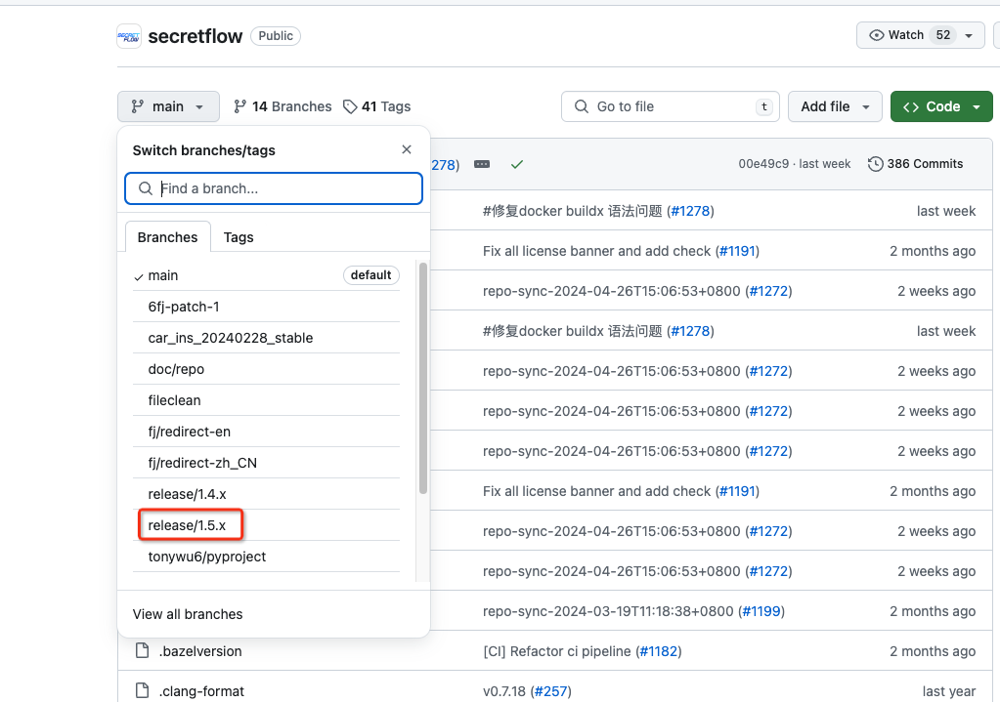 

3.尝试编译并安装隐语

```shell
$ python setup.py bdist_wheel

$ pip install dist/*.whl
```

4.如果安装成功的话，你可以检查一下secretflow的版本（版本不需要和这里一致，只需要确保正确安装即可）

```shell
$ secretflow -v
WARNING:root:Since the GPL-licensed package `unidecode` is not installed, using Python's `unicodedata` package which yields worse results.
SecretFlow version 1.1.0.dev20230817.
(sf)
```

5.在开始之前，先将secretflow移除

```shell
$ pip uninstall secretflow
```

## 创建组件

### 新建文件

在 <span style="color: #E83E8C;"> secretflow/component/ </span> 文件夹下新建文件 <span style="color: #E83E8C;"> compare.py </span>

```shell
$ cd secretflow/component/

$ touch compare.py
```

### 声明组件

```shell
from secretflow.component.component import (
    Component,
    IoType,
    TableColParam,
)

from secretflow.component.data_utils import DistDataType

ss_compare_comp = Component(
    "ss_compare",
    domain="user",
    version="0.0.1",
    desc="""compare two tables.""",
)
```

这段代码表明了：

- 组件名称：<span style="color: #E83E8C;"> ss_compare </span>
- domain: <span style="color: #E83E8C;"> user </span>,可以理解为命名空间/分类
- version: <span style="color: #E83E8C;"> 0.0.1 </span>
- desc: <span style="color: #E83E8C;"> compare two tables. </span> 组件描述。

### 定义组件参数

```shell
ss_compare_comp.int_attr(
    name="tolerance",
    desc="two numbers to be equal if they are within tolerance.",
    is_list=False,
    is_optional=True,
    default_value=10,
    allowed_values=None,
    lower_bound=0,
    lower_bound_inclusive=True,
    upper_bound=None,
)
```

在这里，我们为 <span style="color: #E83E8C;"> ss_compare </span> 定义了一个参数 <span style="color: #E83E8C;"> tolerance </span>
,为了一定程度上保护两位富翁的隐私，我们可以认为在一定范围的区别可以认为是相等的。

<font color=#E83E8C> int_attr </font> 代表了 <font color=#E83E8C> tolerance </font> 是一个integer参数。

- name： 参数名称。
- desc： 描述。
- is_list： 参数是否是一个列表。这里设为False，代表了我们允许用户输入一个integer。如果是True，则代表了允许用户输入一个integer列表。
- is_optional：是否是optional的。这里设为True，代表了用户可以不填，此时会使用default_value。
- default_value：默认值，optional为True时需要给出。
- allowed_values：允许值。None代表禁用。如果给出，那么用户就必须在给出的allowed_values中选择。
- lower_bound：下限。这里是0，代表着我们需要用户给出一个正数。
- lower_bound_inclusive：下限是否是包含。这里是True，代表了lower_bound也是一个合法的输入。
- upper_bound：上限。这里是None，代表了没有上限。

组件还可以设置其他类型的参数，请参阅：
https://github.com/secretflow/secretflow/blob/main/secretflow/component/component.py#L256-L719

### 定义输入输出

```shell
ss_compare_comp.io(
    io_type=IoType.INPUT,
    name="input_table",
    desc="Input vertical table",
    types=[DistDataType.VERTICAL_TABLE],
    col_params=[
        TableColParam(
            name="alice_value",
            desc="Column(s) used to compare.",
            col_min_cnt_inclusive=1,
            col_max_cnt_inclusive=1,
        ),
        TableColParam(
            name="bob_value",
            desc="Column(s) used to compare.",
            col_min_cnt_inclusive=1,
            col_max_cnt_inclusive=1,
        ),
    ],
)


ss_compare_comp.io(
    io_type=IoType.OUTPUT,
    name="alice_output",
    desc="Output for alice",
    types=[DistDataType.INDIVIDUAL_TABLE],
)

ss_compare_comp.io(
    io_type=IoType.OUTPUT,
    name="bob_output",
    desc="Output for bob",
    types=[DistDataType.INDIVIDUAL_TABLE],
)
```

我们在这里定义了两个输出：<span style="color: #E83E8C;"> alice_out put/bob_output </span> 和一个输入 <span style="color: #E83E8C;">input_table </span>

输入和输出的定义是类似的：

- io_type: io类型，输入还是输出。
- name：IO柱的名称。
- desc：描述。
- types：类型，包括：
    - INDIVIDUAL_TABLE：单方表。
    - VERTICAL_TABLE：垂直切分表，联合表。

可以看到input参数还包含col_params，它是一个TableColParam 列表。每一个TableColParam表示用户需要在表中选择一些cols：

- name：cols的名称。这里我们填写了alice_value, 意思是我们需要用户选择一些col作为alice_value列。
- desc：描述。
- col_min_cnt_inclusive：用户选择cols的最少数量。这里的1表示，我们要求用户至少选择一列作为alice_value列。
- col_max_cnt_inclusive：用户选择cols的最多数量。这里的1表示，我们要求用户最多选择一列作为alice_value列。

### 定义组件执行内容

```shell
@ss_compare_comp.eval_fn
def ss_compare_eval_fn(
    *,
    ctx,
    tolerance,
    input_table,
    input_table_alice_value,
    input_table_bob_value,
    alice_output,
    bob_output,
):
    import os

    from secretflow.component.component import CompEvalError
    from secretflow.component.data_utils import (
        DistDataType,
        load_table,
    )
    from secretflow.data import FedNdarray, PartitionWay
    from secretflow.device.device.pyu import PYU
    from secretflow.device.device.spu import SPU
    from secretflow.device.driver import wait
    from secretflow.spec.v1.data_pb2  import (
        DistData,
        IndividualTable,
        TableSchema,
        VerticalTable,
    )

    # only local fs is supported at this moment.
    data_dir = ctx.data_dir
    #local_fs_wd = ctx.local_fs_wd
    
    # get spu config from ctx
    if ctx.spu_configs is None or len(ctx.spu_configs) == 0:
        raise CompEvalError("spu config is not found.")
    if len(ctx.spu_configs) > 1:
        raise CompEvalError("only support one spu")
    spu_config = next(iter(ctx.spu_configs.values()))

    # load inputs
    meta = VerticalTable()
    input_table.meta.Unpack(meta)

    # get alice and bob party
    for data_ref, schema in zip(list(input_table.data_refs), list(meta.schemas)):
        if input_table_alice_value[0] in list(schema.features):
            alice_party = data_ref.party
            alice_ids = list(schema.ids)
            alice_id_types = list(schema.id_types)
        elif input_table_bob_value[0] in list(schema.features):
            bob_party = data_ref.party
            bob_ids = list(schema.ids)
            bob_id_types = list(schema.id_types)

    # init devices.
    alice = PYU(alice_party)
    bob = PYU(bob_party)
    spu = SPU(spu_config["cluster_def"], spu_config["link_desc"])

    input_df = load_table(
        ctx,
        input_table,
        load_features=True,
        load_ids=True,
        load_labels=True,
        col_selects=input_table_alice_value + input_table_bob_value,
    )

    # pass inputs from alice and bob PYUs to SPU
    alice_input_spu_object = input_df.partitions[alice].data.to(spu)
    bob_input_spu_object = input_df.partitions[bob].data.to(spu)

    from secretflow.device import SPUCompilerNumReturnsPolicy

    def compare_fn(x, y, tolerance):
        return (x - tolerance) > y, (y - tolerance) > x

    # do comparison
    output_alice_spu_obj, output_bob_spu_obj = spu(
        compare_fn,
        num_returns_policy=SPUCompilerNumReturnsPolicy.FROM_USER,
        user_specified_num_returns=2,
    )(alice_input_spu_object, bob_input_spu_object, tolerance)

    # convert to FedNdarray
    res = FedNdarray(
        partitions={
            alice: output_alice_spu_obj.to(alice),
            bob: output_bob_spu_obj.to(bob),
        },
        partition_way=PartitionWay.VERTICAL,
    )

    def save(id, id_key, res, res_key, path):
        import pandas as pd

        x = pd.DataFrame(id, columns=id_key)
        label = pd.DataFrame(res, columns=res_key)
        x = pd.concat([x, label], axis=1)

        x.to_csv(path, index=False)

    alice_id_df = load_table(
        ctx,
        input_table,
        load_features=False,
        load_ids=True,
        load_labels=False,
        col_selects=alice_ids,
    )

    wait(
        alice(save)(
            alice_id_df.partitions[alice].data,
            alice_ids,
            res.partitions[alice].data,
            ['result'],
            os.path.join(data_dir, alice_output),
        )
    )

    bob_id_df = load_table(
        ctx,
        input_table,
        load_features=False,
        load_ids=True,
        load_labels=False,
        col_selects=bob_ids,
    )

    wait(
        bob(save)(
            bob_id_df.partitions[bob].data,
            bob_ids,
            res.partitions[bob].data,
            ['result'],
            os.path.join(data_dir, bob_output),
        )
    )

    # generate DistData
    alice_db = DistData(
        name='result',
        type=str(DistDataType.INDIVIDUAL_TABLE),
        data_refs=[DistData.DataRef(uri=alice_output, party=alice.party, format="csv")],
    )

    alice_meta = IndividualTable(
        schema=TableSchema(
            ids=alice_ids,
            id_types=alice_id_types,
            features=['result'],
            feature_types=['bool'],
        ),
        line_count=-1,
    )

    alice_db.meta.Pack(alice_meta)

    bob_db = DistData(
        name='result',
        type=str(DistDataType.INDIVIDUAL_TABLE),
        data_refs=[DistData.DataRef(uri=bob_output, party=bob.party, format="csv")],
    )

    bob_meta = IndividualTable(
        schema=TableSchema(
            ids=bob_ids,
            id_types=bob_id_types,
            features=['result'],
            feature_types=['bool'],
        ),
        line_count=-1,
    )

    bob_db.meta.Pack(bob_meta)

    return {"alice_output": alice_db, "bob_output": bob_db}
```

1.组件执行函数使用decorator <span style="color: #E83E8C;"> @ss_compare_comp.eval_fn </span> 修饰

2.组件执行函数的signature必须为 <span style="color: #E83E8C;"> fn(*,ctx,attr1, attr2, attr3, io1, io1_col1, io1_col2,..., io3,..,
ioN) </span> :

    1.attr1, attr2, attr3指的是组件的attribute的值

    2.io：当io是输入的时候，io是对应的DistData；当io是输出的时候，io是对应的路径；io_col指的是io柱选中的col列名。

    3.ctx包含了所有环境信息，比如spu的config。

## 注册组件

在[https://github.com/secretflow/secretflow/blob/main/secretflow/component/entry.py](https://github.com/secretflow/secretflow/blob/main/secretflow/component/entry.py)
**ALL_COMPONENTS** 注册组件(加入你的新组件)

```shell
from secretflow.component.compare import ss_compare_comp

ALL_COMPONENTS = [
    train_test_split_comp,
    psi_comp,
    ss_sgd_train_comp,
    ss_sgd_predict_comp,
    feature_filter_comp,
    vert_woe_binning_comp,
    vert_woe_substitution_comp,
    ss_vif_comp,
    ss_pearsonr_comp,
    ss_pvalue_comp,
    table_statistics_comp,
    biclassification_eval_comp,
    prediction_bias_comp,
    sgb_predict_comp,
    sgb_train_comp,
    ss_xgb_predict_comp,
    ss_xgb_train_comp,
    ss_glm_predict_comp,
    ss_glm_train_comp,
    ss_compare_comp,
]
```

# 打包隐语镜像

## 更新组件列表及翻译

请在repo更目录执行以下cmd。

```shell
$ cd docker/

$ pip install -r requirements.txt

$ env PYTHONPATH=$PYTHONPATH:$PWD/.. python update_meta.py
Using region  server backend.

WARNING:root:Since the GPL-licensed package `unidecode` is not installed, using Python's `unicodedata` package which yields worse results.
INFO:root:1. Update secretflow comp list.
INFO:root:2. Update translation.
```

此时，你可以检查组件列表是否正确更新：

```shell
$ git diff comp_list.json
```

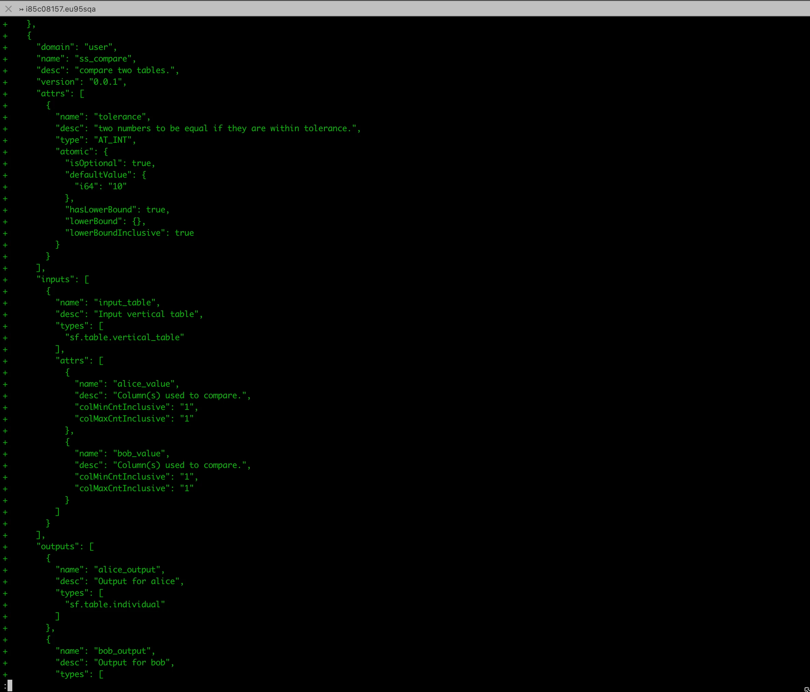

然后你需要检查一下翻译：

```shell
$ git diff translation.json
```


请注意脚本目前是利用公开的翻译API进行处理的，如果有不合理的地方，请自行修改 <span style="color: #E83E8C;"> translation.json </span>

## 打包镜像

```shell
$ cd dev/

# test_compare是image name
$ sh build.sh -v test_compare
```

成功之后你可以用docker inspect来检查镜像。

```shell
docker image inspect secretflow/sf-dev-anolis8:test_compare
```

在打包好镜像之后，需参考后续步骤完成下面操作：

- 将自定义的新组件更新到隐语SecretPad平台组件列表中。
- 将自定义的新组件镜像注册在调度框架Kuscia中。

在完成上述步骤后，就可以在隐语SecretPad平台上使用自定义的新组件了。

# 注册隐语镜像

在注册隐语镜像前，需保证已部署隐语SecretPad平台和调度框架Kuscia节点。

## 1.更新隐语SecretPad平台组件列表

在更新平台组件列表时，需要准备好自定义的Secretflow组件镜像。

### 1.1. 获取工具脚本


```shell

# ${USER}: 表示部署secretpad时使用的用户名称，可以通过命令"docker ps"查看secretpad容器名称
docker cp ${USER}-kuscia-secretpad:/app/scripts/update-sf-components.sh . && chmod +x update-sf-components.sh
```

### 1.2. 运行工具脚本

```shell
# -u: 指定 ${USER}。若不指定，则使用系统默认${USER}，通过命令echo ${USER}查看
# -i: 指定自定义Secretflow组件镜像为 "secretflow/sf-dev-anolis8:test_compare"
# 中心化部署 
sed -i 's/SECRETPAD_CONTAINER_NAME="${DEPLOY_USER}-kuscia-secretpad"/SECRETPAD_CONTAINER_NAME="${DEPLOY_USER}-kuscia-master-secretpad"/g' update-sf-components.sh  
./update-sf-components.sh -u ${USER} -i secretflow/sf-dev-anolis8:test_compare
# P2P部署
./update-sf-components.sh -u ${USER} -i secretflow/sf-dev-anolis8:test_compare

# 查看更多帮助信息
./update-sf-components.sh -h
```

## 2. 在Kuscia中注册自定义算法镜像

有关将自定义Secretflow组件镜像注册到Kuscia ，请参考[注册自定义算法镜像](https://www.secretflow.org.cn/docs/kuscia/latest/zh-Hans/development/register_custom_image)

⚠️**注意事项**

- 使用 <span style="color: #E83E8C;"> -n secretflow-image </span> 指定注册在Kuscia中的算法镜像AppImage名称为 <span style="color: #E83E8C;">
  secretflow-image </span>。
- 使用 <span style="color: #E83E8C;"> -i docker.io/secretflow/sf-dev-anolis8: test_compare </span> 指定打包的自定义Secretflow组件镜像。由于默认打包的镜像Repo为 docker.io，因此在导入镜像时需填写完成的镜像信息。

```shell
# -u: 指定 ${USER}
# -m: 指定中心化组网模式部署方式为 "center"
# -n: 指定Kuscia AppImage名称为 "secretflow-image"
# -i: 指定自定义Secretflow组件镜像为 "docker.io/secretflow/sf-dev-anolis8:test_compare"
./register_app_image/register_app_image.sh -u ${USER} -m center -n secretflow-image -i docker.io/secretflow/sf-dev-anolis8:test_compare
```

# 在隐语SecretPad平台上使用新组件

## 导入数据

📎[alice_bank_account.csv](https://www.yuque.com/attachments/yuque/0/2023/csv/29690418/1692964409932-ae408839-c9a0-47d8-af28-9586e32315f3.csv)

📎[bob_bank_account.csv](https://www.yuque.com/attachments/yuque/0/2023/csv/29690418/1692964412445-26b38397-cac9-4223-938e-9c08ca4e612e.csv)

请在alice节点导入alice_bank_account

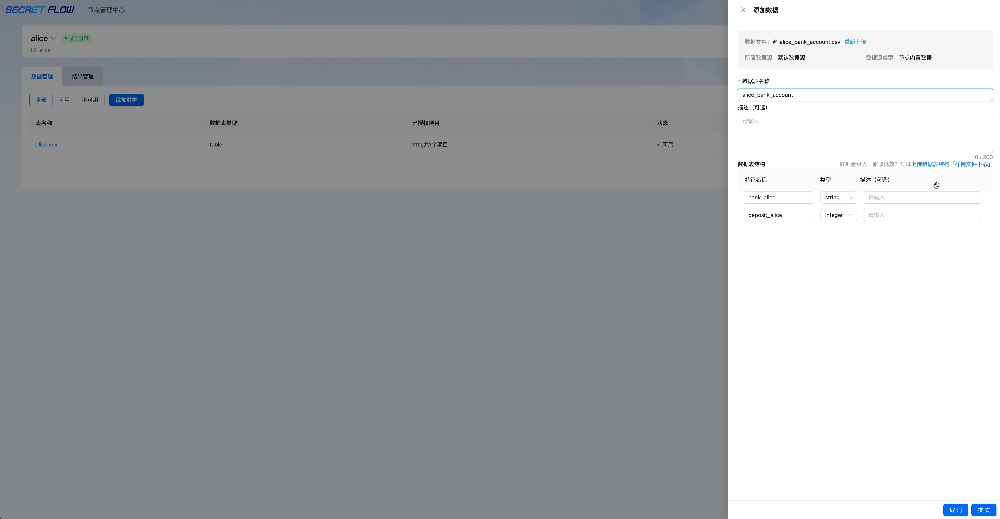

然后在bob节点导入bob_bank_account


## 新建项目

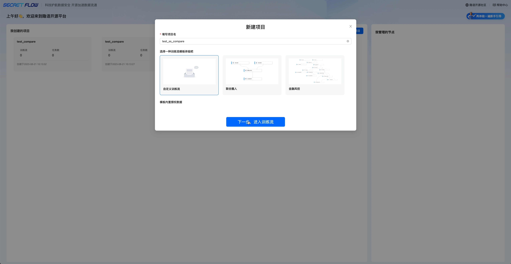

观察组件库，新组件已经成功注册

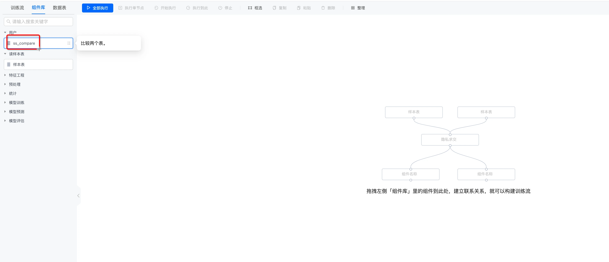

## 数据授权

在alice节点，将alice_bank_account授权给项目，注意关联键为bank_alice.


在bob节点，将bob_bank_account授权给项目，注意关联键为bank_bob.


## 构建训练流

按照下图构建训练流


样本表组件1配置：


样本表组件2配置：


隐私求交组件配置：

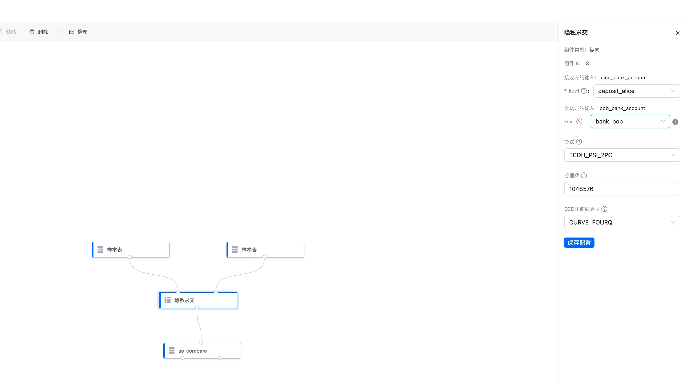

ss_compare组件配置：

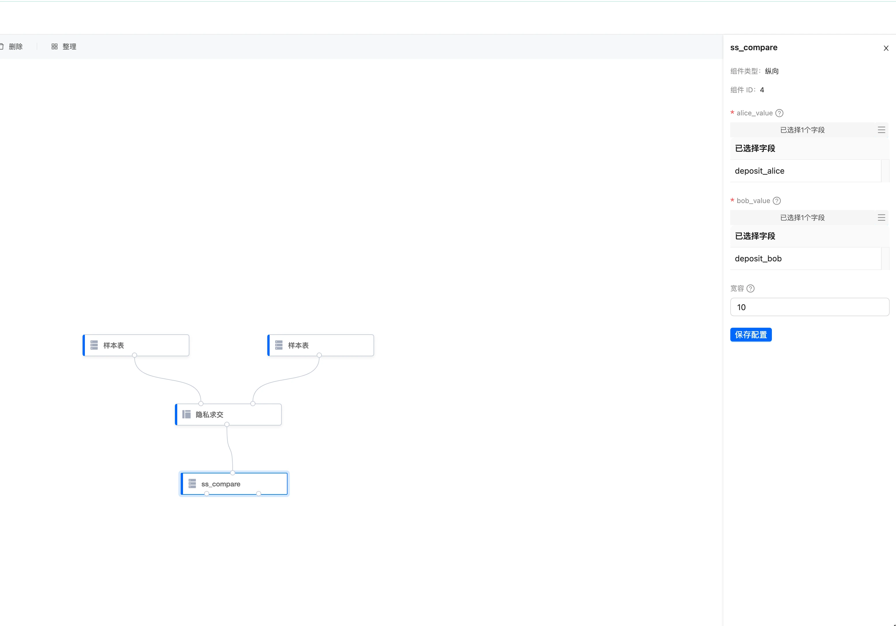

## 执行训练流

点击全部执行按钮。

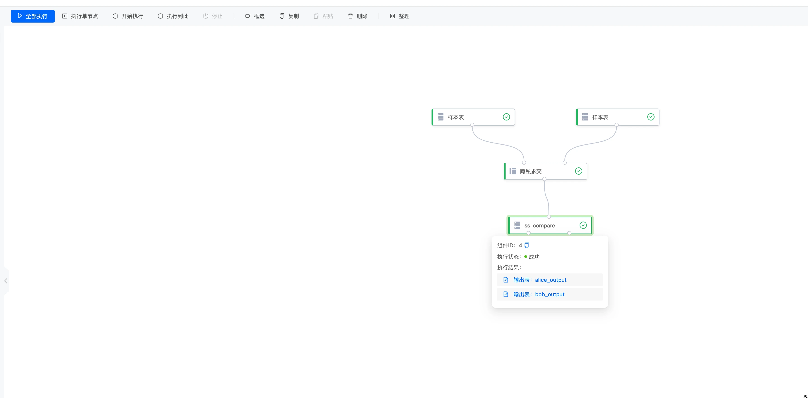

## 查看结果


# 总结

以上为隐语SecretPad平台新增组件的全部教程。

如果你对教程存在疑问，你可以直接留言或者在[GitHub Issues](https://github.com/secretflow/secretflow/issues)中发起issue。

如果你想要了解更多隐语组件的信息，请阅读[这些文档](https://www.secretflow.org.cn/docs/secretflow/latest/zh-Hans/component)。
